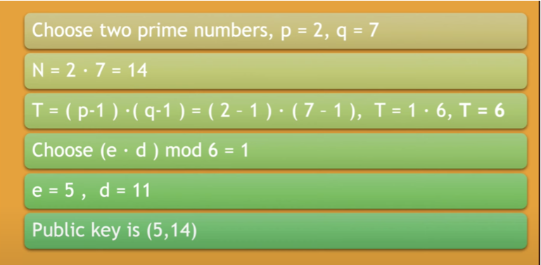

# Generation Private & Public Keys


```
p, _ := rand.Prime(rand.Reader, 64)
q, _ := rand.Prime(rand.Reader, 64)
```
```
N := new(big.Int).Mul(p, q)
```
```
Pminus1 := new(big.Int).Sub(p, new(big.Int).SetInt64(1))
Qminus1 := new(big.Int).Sub(q, new(big.Int).SetInt64(1))
PHI := new(big.Int).Mul(Pminus1, Qminus1)
```
```
e := new(big.Int).SetInt64(65537)
d := new(big.Int).ModInverse(e, PHI)

// PUBLIC KEY for encryption is (e, N)
// PRIVATE KEY for dencryption is (d, N)

// Sample Message
M, _ := new(big.Int).SetString(Mval, 10) // Base 10
```


```
C := new(big.Int).Exp(M, e, N)
```

```
Plain := new(big.Int).Exp(C, d, N)
```